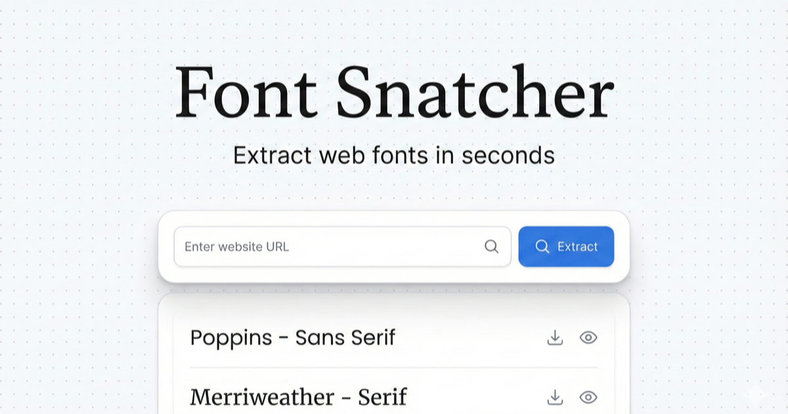

## Font Snatcher



Extract web fonts from any public site. Preview, download, match legal alternatives.

### What it does

- Crawl target page + linked stylesheets.
- Parse `@font-face` entries.
- Return unique fonts with format, weight, style, source URL.
- Proxy preview/download through signed URLs (`/api/font`).
- Label likely license status + suggest Google Fonts alternatives.
- For known paid families, show `Get License` and open foundry/license page in a new tab.

### Stack

- Bun + TypeScript
- TanStack Start / Router
- Vite + Tailwind v4
- Nitro (`cloudflare-module` preset)
- Vitest

### Quick start

```bash
bun install
bun run dev
```

App runs at `http://localhost:3000`.

### Scripts

```bash
bun run dev           # local dev server
bun run build         # production build
bun run preview       # preview build
bun run test          # vitest suite
bun run lint          # oxlint
bun run lint:fix      # oxlint autofix
bun run format        # oxfmt write
bun run format:check  # oxfmt check
bun run typecheck     # tsgo typecheck
bun run fonts:refresh # refresh Google Fonts snapshot
```

### API

`POST /api/extract`

```json
{ "url": "https://linear.app" }
```

Response font entries include:

- `licenseStatus`: `free_open` | `known_paid` | `unknown_or_paid`
- `licenseNote`: human-readable warning/context
- `licenseUrl` (optional): foundry/license page for `known_paid`
- `downloadUrl`: signed proxy URL, or foundry license URL when `known_paid`

`POST /api/match`

```json
{ "family": "Inter", "weight": "400", "style": "normal" }
```

`GET /api/font`

- Signed proxy URL generated by server.
- Not intended to be handcrafted client-side.

### Environment

- `FONT_PROXY_SECRET` (required in production)
  - Minimum 16 chars.
  - Used to sign/verify proxy URLs for `/api/font`.

Local dev: if unset, app generates ephemeral secret automatically.

### Security notes

- SSRF guardrails on extraction + font proxy targets.
- Manual redirect handling for proxied font fetches.
- Response size limits for HTML/CSS/font payloads.

### Licensing behavior

- `free_open`: direct download enabled.
- `known_paid`: no direct font-file download; redirect to foundry/license page.
- `unknown_or_paid`: warning modal + download still allowed.

### Deploy

Nitro config targets Cloudflare module runtime (`nitro.config.ts`).

Build:

```bash
bun run build
```

Before production deploy, set `FONT_PROXY_SECRET`.

### Social preview image (OG/Twitter)

- Source file: `public/og-image.png` (expected size `1200x630`).
- Production URL: `https://fonts.oschat.ai/og-image.png`.
- Meta tags are set in `src/routes/__root.tsx` via `OG_IMAGE_URL` and used for both:
  - `og:image`
  - `twitter:image`
